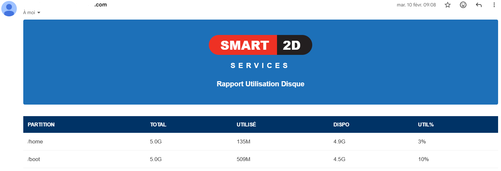

# Automated Server Health Monitor 🚀


A comprehensive system monitoring solution that combines a self-hosted network infrastructure with Python-driven automation to ensure high availability and proactive server management.

## 📌 Overview

This project was developed to automate the critical task of monitoring server resources. Unlike standard scripts, this solution relies on a **fully self-administered infrastructure**, including a custom DNS server and a Postfix MTA, demonstrating a deep understanding of the entire data pipeline and system administration.

## 🛠 Tech Stack

* **Language:** Python 3.13.5
* **Infrastructure:** * **Postfix:** Configured as a local Mail Transfer Agent (MTA) for secure report dispatching.
    * **DNS Server:** Self-hosted for internal hostname resolution and network reliability.
* **OS Environment:** Linux Virtual Machine (VM).
* **Key Libraries:** `smtplib`, `email.mime`, `psutil` (or native subprocess calls).

## ✨ Key Features

* **Real-time Storage Analysis:** Automatically monitors critical partitions such as `/home` and `/boot`.
* **Automated HTML Reporting:** Generates clean, professional status tables including:
    * Total Capacity
    * Used Space
    * Available Space
    * Usage Percentage (%)
* **Autonomous Alerting:** Scheduled dispatch of server health reports via the internal SMTP relay.
* **Observability:** Provides immediate visibility into system health to prevent data pipeline failures.

## 📊 Sample Output

The system generates structured email reports as shown below:



## 🚀 Why This Matters

As an aspiring **Data Engineer**, I believe that observability is the backbone of any robust data architecture. By building the infrastructure (DNS/SMTP) from scratch before implementing the automation logic, I ensured a highly autonomous and secure monitoring environment. This project showcases my ability to bridge the gap between **Software Development** and **System Operations (DevOps)**.

## ⚙️ Configuration & Setup

1. **Clone the repository:**
   ```bash
   git clone [https://github.com/AMENOUSSI/Automated-Server-Health-Monitor.git](https://github.com/AMENOUSSI/Automated-Server-Health-Monitor.git)
   cd Automated-Server-Health-Monitor
2. Setup configuration:

   Copy the example file and fill in your real credentials:

    cp df_h_mail.json.example df_h_mail.json

3. Run the script:
 
   python3 ver2_mail.py

   
## 🐳 Run with Docker

1. **Build the image:**
   ```bash
   docker build -t server-monitor 
   
2. Run the container:

docker run --rm -v $(pwd)/df_h_mail.json:/app/df_h_mail.json server-monitor

## 📝 License

This project is open-source and available under the [MIT License](LICENSE).
